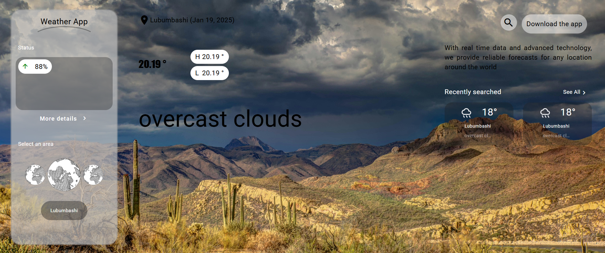
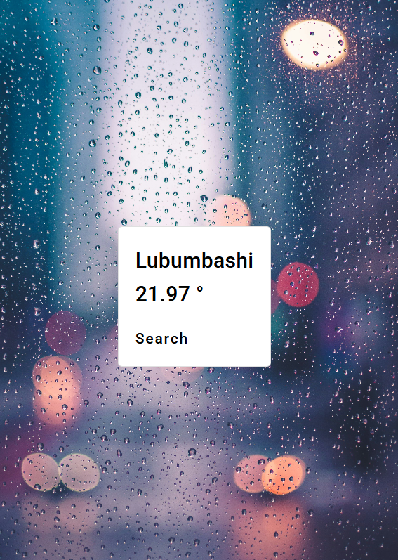

# WeatherApp
<p align="center">
  
  
</p>
This is a simple weather application built using Angular that fetches real-time weather data from a weather API and displays it to the user.
**Key Features:**

* **User-friendly interface:** Clean and intuitive design for easy navigation.
* **Real-time weather data:** Fetches current weather information including temperature, humidity, wind speed, and weather conditions.

* **Adaptative theming** The theme of the app changes according to the weather.

**Technologies Used:**

* **Angular:** A powerful JavaScript framework for building dynamic and interactive web applications.
* **OpenWeatherMap API** the weather service provider.
* **Unsplash API** the image service provider.

**How to Run the App:**

1. **Clone the repository:**
   ```bash
   git clone <repository_url>
2. **Install the dependecies**
    ```bash 
    cd weather-app
    npm install
3. **Start the developpment**
    ```bash
    ng serve


**For developpers:**
This is a simple weather application built using Angular that fetches real-time weather data from a weather API and displays it to the user. You can try to add some functionnalities to it like a search-based service to provide meteo data for other cities. Have FUN